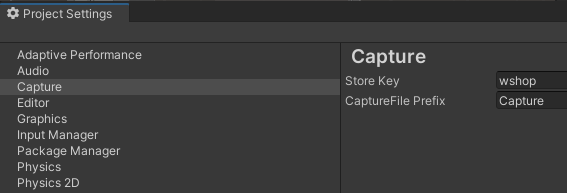
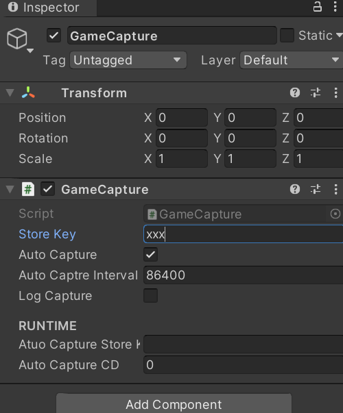

# unity-quickdemo
This package is to speed up demo development.

## Installation
Add git url from unity package manager:  
https://github.com/k021Ng/unity-quickdemo.git

## Requirement
Unity 2020.3 or later

## Capture
In order to record the development progress of the game, auto-capture function has been added. You can set the capture saving path in *ProjectSetting*, or add *GameCapture* component to save screenshots at regular intervals.

## TODO
[x]capture  
[+]tutorial  

## Issue  
> After quickdemo upgrade sometimes, VSCode cant reimport right csproject.  
Please delete QuickDemo.csproj and QuickDemo.Editor.csproj files, then reimport package from unity.  
If not work, please find menu "Unity>Edit>Preferences>External Tools", then click "Regenerate project files".

